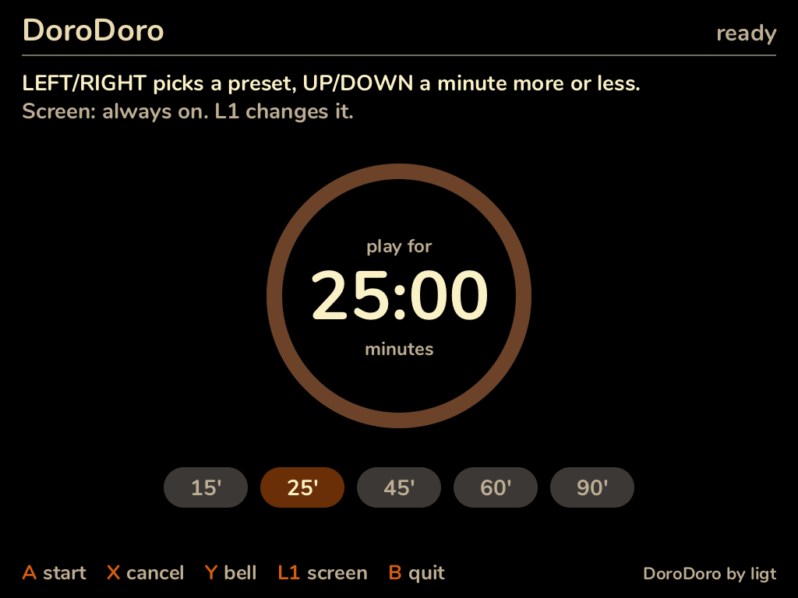
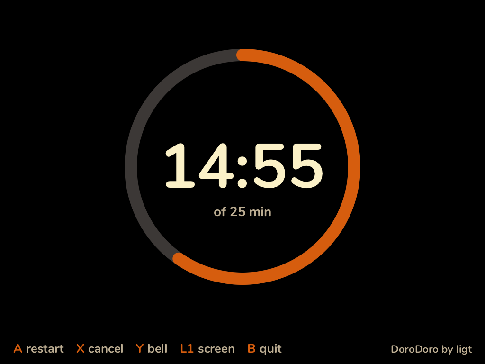
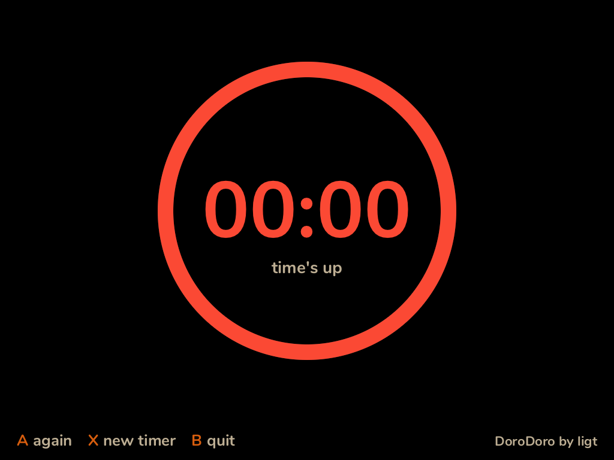

# DoroDoro

Hẹn giờ chơi game cho **TrimUI Brick Pro**, kiểu pomodoro.

*[English](README.md)*

  
  
  

Chọn số phút muốn chơi, bấm A rồi vào chơi. Trong lúc bạn chơi game, DoroDoro
vẫn đếm ngầm. Hết giờ thì máy **rung, đổ chuông và chớp đỏ toàn bộ đèn LED**,
ngay trong lúc đang chơi. Kể cả khi máy đã sleep, hết giờ nó cũng tự thức dậy
để báo.

- **Chạy ngầm.** Bấm bắt đầu, bấm B, rồi mở game nào cũng được. Mở lại
  DoroDoro để xem còn bao lâu, hoặc hủy hẹn giờ.
- **Khó mà bỏ lỡ.** Còn 5 phút và còn 1 phút thì máy nhắc nhẹ (rung, một
  tiếng chuông, LED đỏ). Hết giờ thì báo thức kêu, lặp lại trong 2 phút.
- **Tắt ngay trong game.** Bấm **SELECT + START** cùng lúc. Trên Brick Pro,
  RetroArch không gán gì cho tổ hợp này.
- **Đánh thức máy.** Nếu bạn bấm nút nguồn cho máy sleep, hết giờ máy sẽ tự
  thức dậy.
- **Làm đồng hồ để bàn.** Trong app, đồng hồ đếm ngược chiếm cả màn hình.
  Màn hình có thể luôn sáng, hoặc tự tắt sau 30 giây không bấm.
- **Đèn LED về như cũ.** Báo thức xong, LED trở lại màu và hiệu ứng bạn đang
  dùng.

## Tải về

Chọn bản đúng với firmware của bạn ở **[bản phát hành mới nhất](../../releases/latest)**. Đó
là nguồn chính thức của DoroDoro, kèm mã SHA-256 của từng file trong
`SHA256SUMS.txt`. Nếu tải DoroDoro ở nơi khác, hãy so mã của file
(`sha256sum DoroDoro-*.zip`) với danh sách đó trước khi cài.

| Firmware | File |
|---|---|
| [spruceOS](https://github.com/spruceUI/spruceOS) | `DoroDoro-<phiên-bản>-spruceOS.zip` |
| TrimUI gốc | `DoroDoro-<phiên-bản>-stockOS.zip` |

Hai bản là cùng một app. Chỉ khác thư mục mà firmware tìm app.

## Cài đặt

1. Giải nén thẳng vào thư mục gốc của thẻ SD, chọn gộp thư mục nếu được hỏi.
   Trong zip đã có sẵn đúng thư mục cho firmware của bạn: `App/DoroDoro` cho
   spruceOS, `Apps/DoroDoro` cho TrimUI gốc.
2. Mở **DoroDoro** từ launcher.

DoroDoro được phát triển và thử trên spruceOS. Bản cho firmware gốc là cùng
một chương trình, nhưng chưa được thử trên firmware gốc.

## Hướng dẫn

| Nút | Màn chọn thời gian | Màn đồng hồ |
|---|---|---|
| TRÁI / PHẢI | mốc trước / sau (15, 25, 45, 60, 90) | — |
| LÊN / XUỐNG | thêm / bớt 1 phút | — |
| A | bắt đầu | đếm lại từ đầu |
| X | hủy hẹn giờ đang chạy | hủy |
| Y | nghe thử chuông | nghe thử chuông |
| L1 | màn hình: luôn sáng / tắt sau 30 giây | như bên trái |
| B | về launcher, hẹn giờ vẫn chạy | như bên trái |

**Khi chuông kêu, bấm SELECT + START cùng lúc** để tắt rung, chuông và LED, ở
đâu cũng được. Mở DoroDoro rồi bấm X cũng tắt được. Không làm gì thì sau 2
phút nó tự tắt.

Nên biết:

- Game cũng nhận được SELECT + START. Có game sẽ hiểu là tạm dừng.
- Chuông phát qua loa của máy, theo âm lượng hệ thống, chồng lên tiếng game.
- DoroDoro nhớ số phút bạn chọn lần trước và chế độ màn hình.

## Báo lỗi

[Mở issue](../../issues/new?template=bug_report.yml), ghi firmware, phiên bản,
và đính kèm 2 file log trong thư mục app trên thẻ nhớ: `dorodoro.log` và
`dorodoro-alarm.log`.

---

Repo này chỉ chứa bản phát hành và tài liệu; mã nguồn chưa công khai.
DoroDoro là phần mềm độc quyền, xem [LICENSE](LICENSE). Bạn được chia sẻ các
file zip miễn phí, nhưng phải giữ nguyên: mỗi file phải khớp mã checksum trên
trang phát hành của nó. Kèm theo chỗ tải, hãy ghi tên DoroDoro, tác giả và
link đến trang đó. Các thành phần mã nguồn mở trong binary, cùng giấy phép của
chúng, được liệt kê trong file `THIRD_PARTY.md` có trong mỗi file zip.

DoroDoro được cung cấp nguyên trạng, không kèm bảo hành. DoroDoro không liên
kết với TrimUI hay spruceOS; tên của họ là nhãn hiệu của chủ sở hữu.
